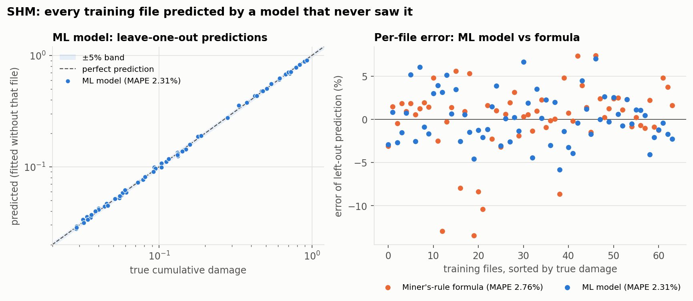

# NebulaX PS3 — Train Fault Prediction

Four predictors for NebulaX 2026 Problem Statement 3 (train condition monitoring).
Each one takes a single data file and returns a prediction plus a plain-language
explanation that the app can show on screen.

> **All scores below are cross-validated on the training data.** The organisers
> hold the test labels, so none of these numbers is a test result.

## Results at a glance

| Subsystem | Task | How it works | CV score | Checked with |
|---|---|---|---|---|
| **Door** | Find each open/close cycle, label it Normal or Abnormal resistance | Time-gap segmentation + motor current relative to the file's own baseline | **0.996** (110/110 on the full stream) | 5-fold × 5 seeds, 110 cycles |
| **SHM** | Estimate cumulative fatigue damage | Ridge regression on rainflow damage sums + signal statistics | **0.977** (MAPE 2.31%) | leave-one-out, 64 files |
| **ACV** | Rank the 8 cars by refrigerant-leak likelihood | Logistic regression on 4 cabin-temperature features, each relative to the other cars | **0.979** (true car 1st in 5 of 6 cases, 2nd in 1) | leave-one-case-out, 6 cases |
| **Rail** | Normal / Side I / Side II corrugation | 73 vibration features + soft-vote ensemble | **0.84 ± 0.02** macro F1 (nested: 0.83) | 5-fold × 20 seeds, 272 files |

If these estimates hold, the Overall Score is roughly **0.93–0.95**. ACV (a single
test file) and Rail (only a handful of Side I files in the test set) are the two
that can move it.

## Install

```bash
pip install -r requirements.txt
```

The Rail model was saved with **scikit-learn 1.8.0**. Use that exact version so
the predictions don't drift.

## Use

```python
from ps3 import predict

predict.run("door", "Test.csv")
predict.run("shm",  "test01.csv")
predict.run("acv",  "acv_test_case.xlsx")
predict.run("rail", "Test1.csv")
```

Every call returns `{"prediction": ..., "detail": {...}}`. `detail` is written to be
shown directly in the app and explains why the prediction was made. Door is the
exception: it returns `{"segments": DataFrame, "detail": {...}}`, because one file
contains many door cycles. `predict.SUBSYSTEMS` lists each subsystem's display
name and accepted file types, which is enough to build the upload page.

Every `detail` also has `evidence`, `priority` and `priority_reason`, which compare the
file with the training data (see [Evidence and priority](#evidence-and-priority-for-root-cause-analysis)).

The same predictors run from the command line, for one file or a whole folder. This
writes the CSV in the exact submission format:

```bash
python -m ps3.predict --subsystem shm  --input SHM/Test --output shm_predictions.csv
python -m ps3.predict --subsystem door --input Door/Test.csv --output door_predictions.csv
```

## The data

All data comes from the organisers' repository; no other data is used or available.

| Subsystem | Files (train / test) | One file is | Used by the model | Labels |
|---|---|---|---|---|
| Door | 1 / 1 CSV stream | 50 Hz stream, 17 columns (motor current, voltage, back-EMF, commands, limit switches, door state, leaf position). Train: 18,036 rows, 110 cycles, 70 min. Test: 6,253 rows, 38 cycles | timestamps, motor current, "door is closing" flag | start, end and label per cycle; 27% abnormal |
| SHM | 64 / 16 CSV | 581,120 stress samples, one column, no header; two lines, two load conditions (AW0 / AW4) | the whole stress series | cumulative damage, 0.03–0.93 |
| ACV | 6 / 1 XLSX | 30-second telemetry for all 8 cars, 3,263–22,262 rows; 8 parameters per car (one case has 63, with different names) | indoor average temperature, setting mode | which car leaks |
| Rail | 272 / 68 CSV | 1 s at 10 kHz: 10,000 rows × 129 columns (speed pulse + vibration and shock for 64 axle boxes) | all 128 vibration/shock channels + speed | 234 Normal, 14 Side I, 24 Side II |

## Data checks and cleaning

- **Rail:** no missing values, no dead or flat channels, and no saturation (largest
  reading 35 m/s² against a ±400 m/s² range). Some shock sensors run much quieter than
  others, so the features summarise each side over many axle boxes instead of
  trusting single sensors. All 47 stationary files (< 5 km/h) are Normal and every
  fault file is at 35 km/h or faster. Speed is decoded from the 90-tooth wheel pulse.
  Wavelength features are left blank when the train is stationary: gradient boosting
  handles blanks natively, and the SVM and logistic regression fill them with the
  training median.
- **SHM:** non-finite samples would be dropped, but none occur (every file has the
  full 581,120 samples). No filtering or detrending, because the labels were made
  from the raw series.
- **Door:** the non-padded timestamp format (`Y-M-D-H-M-S-ms`) is parsed explicitly.
  Splitting on gaps longer than 1 second reproduces all 110 labelled cycles exactly.
- **ACV:** column names are read from each file's own headers, and the one case with a
  different vocabulary is mapped onto the common names. Zero temperature readings are
  treated as dropouts. Masking rows flagged "Invalid" or not in cooling mode was
  tested and gives the same ranking. **Case 04 is incomplete:** cars 05–08 have no
  cabin temperature readings at all, and cars 01–04 report whole degrees only.

## How each model works

### Door: relative current threshold

1. **Segment:** split the stream wherever samples are more than 1 s apart. This
   matches every labelled cycle, so every IoU is 1.0 and the IoU-weighted F1 becomes
   plain accuracy.
2. **Feature:** the mean motor current of each cycle.
3. **Baseline:** for each operation (open, close), the 40th-percentile cycle current
   *in the same file*. Ratio = cycle mean ÷ baseline.
4. **Decide:** Abnormal resistance if the ratio is ≥ 1.107. That is the midpoint
   between the highest normal (1.074) and the lowest abnormal (1.141) training ratio.


The threshold is relative because current levels shift between doors. Test's closing
cycles have a median of 464 mA, right on Train's absolute cut-off of 470 mA. The Door
Info Kit warns about exactly this.

| Method | CV accuracy | +37 mA offset | ×1.09 gain | ×0.92 gain |
|---|---|---|---|---|
| **Relative threshold (used)** | **0.996** | **1.000** | **1.000** | **1.000** |
| Gradient boosting on relative features | 0.996 | 1.000 | 1.000 | 1.000 |
| Absolute threshold per operation | 0.991 | — | — | — |
| Gradient boosting on raw features | 0.984 | 0.573 | 0.545 | 0.682 |

The relative baseline is what matters, not the model type, so the simplest and most
explainable option is used. The rule stays reliable until about 55% of a file's
cycles are abnormal; beyond that the 40th percentile lands among the abnormal cycles.
Train has 27% abnormal cycles and the test predictions 17–25%. On the test file the
ratios closest to the threshold are 1.072 and 1.204, so no cycle is borderline.

### SHM: machine learning on rainflow physics

The Info Kit asks for a regression model that predicts one damage value per file. It
says the labels were made with rainflow counting and Miner's rule, but that teams
don't have to use that method. The model uses that physics as its inputs and learns
the rest from the 64 labelled files:

1. **Rainflow counting** of the stress series. Amplitude = range ÷ 2, and half cycles
   count 0.5.
2. **Features (30):**
   - 9 rainflow damage sums, log(Σ count × amplitude^m) for m = 3.0, 3.5, …, 7.0, so
     the model learns how much each amplitude level matters instead of fixing it;
   - 21 signal statistics: mean, spread, skew, kurtosis, range, 7 percentiles, 2
     step-size measures, turning-point rate and 6 spectral band shares.
3. **Model:** ridge regression on log damage, with standardised features. The
   regularisation strength is chosen by cross-validation inside each training fold.
4. **Cross-check:** Miner's rule itself, `damage = Σ count × amplitude^m / C` with
   fitted m = 5.03 and C = 7.98 × 10⁸ (`params_shm.json`), is computed for every file
   and shown in `detail` next to the model's answer, along with which amplitude bands
   drive the damage.



| SHM model | Leave-one-out MAPE | Score |
|---|---|---|
| ML on signal statistics only: gradient boosting / random forest | 19.0% / 20.4% | 0.81 / 0.80 |
| ML on signal statistics only: ridge regression | 10.1% | 0.90 |
| ML on rainflow damage features: gradient boosting / random forest | 8.9% / 5.0% | 0.91 / 0.95 |
| ML on rainflow damage features: ridge regression | 2.56% | 0.974 |
| **ML on both: ridge regression (used)** | **2.31%** | **0.977** |
| Miner's-rule formula, m and C fitted | 2.76% | 0.972 |

The model was picked from these ML configurations, so it was confirmed on 20 repeated
8-fold splits: 2.37% against 2.72% for the formula, better on all 20, and the worst
single-file error drops from 13.4% to 6.9%. Tree models do poorly here because 64
files are too few for them to learn a smooth power law, while ridge regression on log
damage sums can represent one almost exactly. Signal statistics alone are not enough:
the standard deviation only reaches R² 0.56 against the labels, while the rainflow
damage sum reaches 0.9989.

Before moving to the model, these formula variants were tested; none beat the
formula's 2.76%:

| Variant | Result |
|---|---|
| Range binning (15 `nbins`, 11 `binsize` settings, bin centres, rounding) | 2.56–2.61% in-sample, no real gain |
| Half cycles counted as full, or dropped | worse |
| Two-slope S-N curve (knee and both slopes fitted) | 2.81% leave-one-out |
| Goodman / Gerber mean-stress correction | 3.20% / 2.62% in-sample |

The model runs in about 0.5 s per file (581,120 samples), so it also meets the Info
Kit's call for automated, efficient assessment.

### ACV: trained ranker on cabin temperature relative to the other cars

A refrigerant leak means less cooling capacity, so that car's cabin runs warmer than
the others under the same weather, time of day and route. Every feature is measured
against the other cars at the same moment, which cancels all three.

1. At each timestamp, each car's indoor temperature minus the median of all cars.
2. Four features per car: the mean of that difference (`dev`, the physics score), the
   same over the hotter half of the recording (`dev_hot`), the share of time the car is
   the warmest (`warmest_share`), and indoor temperature minus setpoint, again relative
   to the other cars (`dev_setpoint`). Each is z-scored across the cars of the file.
3. A logistic regression trained on the 6 cases (48 cars, 6 of them leaking, balanced
   class weights) scores each car. Exactly one car leaks per file, so the scores are
   turned into probabilities that sum to 1, and the cars are ranked by them.

Learned weights: `warmest_share` 1.25, `dev_hot` 0.67, `dev` 0.66, `dev_setpoint` 0.02.

The physics score (`dev` alone, ranked warmest to coolest) is kept in `detail` as a
cross-check (`scores_degC`, `physics_top_car`, `physics_agrees`), and the share of time
the crew switched each car to Manual Control is still shown as supporting evidence.
`confidence` is high when the top car's probability is at least 0.8 and medium when it
is at least 0.5. In leave-one-case-out testing every "high" was correct, and the one
miss (case 04) was "medium".


Leave-one-case-out (fit on 5 cases, test on the 6th): the true car ranks 1st in 5 of 6
cases and 2nd in 1 (score 0.979; a random ordering scores 0.5625). Expect 0.88–1.00 on
a single held-out file. The one miss, case 04, is a data problem rather than a model
problem: only cars 01–04 have cabin readings in that file, and only in whole degrees.

| Method | c01 | c02 | c03 | c04 | c05 | c06 | Test pick |
|---|---|---|---|---|---|---|---|
| **Trained ranker, 4 temperature features (used)** | 1 | 1 | 1 | 2 | 1 | 1 | **Car 01** (p = 0.88) |
| Trained ranker, all 9 logged signals | 1 | 1 | 1 | 3 | 1 | 1 | Car 04 |
| Cabin temp vs car median (physics, cross-check) | 1 | 1 | 1 | 2 | 1 | 1 | Car 01 (+0.035 °C) |
| Valid, cooling-mode rows only | 1 | 1 | 1 | n/a | 1 | 1 | Car 01 (+0.042) |
| Cabin temp vs each car's own setpoint | 1 | 1 | 1 | 2 | 1 | 1 | Car 01 (+0.166) |
| Warmest half of timestamps only | 1 | 1 | 1 | 3 | 1 | 1 | Car 01 (+0.016) |
| Share of time in Full Cooling | 2 | 2 | 3 | n/a | 6 | 7 | no signal |
| Share of time load-halved | 1 | 2 | 3 | n/a | 4 | 6 | no signal |

(Numbers are the rank of the true faulty car; 1 = correct. The trained rows are
leave-one-case-out.) The trained ranker and the physics score pick the same car on the
test file and differ only in 2nd and 3rd place (04 before 03). Relative to each car's
own setpoint, the physics margin is almost 5× larger, which suggests the runner-up is
warmer because of a higher setpoint, not a leak. Adding the other logged signals
(cooling mode, load halving, manual control, spread) made the model worse on 6 cases,
so they are left out; with more labelled cases they may start to help. Caveat: these
variants were compared on the same six cases, which is selection on the evaluation set.
The trained ranker is used because it is a model that can learn from new cases, not
because it scored higher: it ties the physics score.

### Rail: vibration features + soft-vote ensemble

Each car has 8 axle boxes. Odd positions ride on the Side I rail and even positions
on Side II, and each box carries a vibration and a shock sensor.

**Features (73), computed per file by `rail.featurize` (~1 s per file):**

- **Speed**, from the 0/1 transitions of the 90-tooth wheel pulse and the 0.85 m wheel.
- **Side features (56):** for each of 4 channel groups (Side I vibration, Side II
  vibration, Side I shock, Side II shock):
  - mean and max channel RMS, kurtosis and crest factor;
  - energy share in 6 frequency bands (50–5,000 Hz);
  - energy share in 4 wavelength bands (20–320 mm, using wavelength = speed ÷ frequency).
- **Loudest-axle-box features (16):** per side and sensor type, the log-RMS of the
  loudest box, the mean of the 3 loudest, the median box, and loudest minus the file
  median.

**Model:** a soft vote (average of class probabilities) of three different learners.
All three use balanced class weights to account for the rare fault classes.

- gradient boosting (HistGradientBoosting, 300 iterations);
- RBF-SVM (C = 3, standardised);
- logistic regression (C = 0.1, standardised).

| | Previous model (gradient boosting, 57 features) | Current model (ensemble, 73 features) |
|---|---|---|
| Macro F1, 5-fold × 20 seeds | 0.80 ± 0.04 | **0.84 ± 0.02** (better on 18 of 20 splits) |
| Normal F1 | 0.978 | 0.978 |
| Side I F1 | 0.597 | **0.676** |
| Side II F1 | 0.830 | **0.863** |

**What the data showed:**

- **Loudest boxes carry the signal.** Corrugation shows up in the few loudest axle
  boxes on the faulty side. Median-based features wash it out: left-vs-right
  contrasts built on medians scored only 0.46.
- **The sides aren't mirror images.** Swapping Side I and Side II channels to create
  extra examples made things worse (0.805).
- **Errors are mostly misses.** Most Side I errors are faults called Normal, not
  confusion with Side II.
- **Faults need speed.** Faults only appear at 35 km/h or more, and stationary files
  are always Normal.

**Other approaches tested (macro F1):**

| Approach | Macro F1 |
|---|---|
| Random forest / extra trees | 0.68 / 0.72 |
| SVM alone / logistic regression alone | 0.76 / 0.76 |
| Gradient boosting alone | 0.81 |
| Per-sensor speed calibration | 0.70–0.74 |
| Extra per-band loudest-box features | 0.78 |
| Symmetric "is this side corrugated?" scorer | 0.42–0.79 |
| Decision rule tuned inside the folds | +0.012, not adopted |

Feature importance, feature selection and weighting tests are in their own section
below.

**Caveats:**

- With 3–4 Side I files expected in the test set, the realised score can move by
  about 0.1 either way.
- One test file is a genuine toss-up: Test9 is 65% Side II under the old model and
  65% Normal under the new one.

## Evidence and priority (for root cause analysis)

Every `detail` also carries three fields for the app's root cause analysis:

- `evidence`: short findings, each comparing this file with the training data.
- `priority`: `low`, `medium` or `high`.
- `priority_reason`: one sentence saying why.

The app sends the whole result to Gemini (`ps3/rca.py`), so its cause and action text
can quote these numbers instead of guessing how serious a fault is. The fields never
change a prediction. Each fit script saves the training reference values with its model;
Door's are constants in `door.py`.

| Subsystem | Evidence compares | High | Medium | Low |
|---|---|---|---|---|
| Door | the worst cycle's current ratio with training cycles (normal ≤ 1.074×, abnormal 1.141–1.731×, median 1.323×); warns when over half of one operation's cycles are flagged | worst cycle ≥ 1.323×, or over half of one operation flagged | milder abnormal cycles | no abnormal cycle |
| SHM | damage and largest amplitude with the 64 training files; the model vs Miner's-rule gap with its training range; remaining capacity 1 − D | D ≥ 1, the failure criterion | D ≥ 0.5, half the capacity used (a policy choice) | D < 0.5 |
| ACV | the top car's excess with training leaking cars (0.122–1.272 °C) and normal cars (at most 0.250 °C); the physics cross-check | excess above every normal training car, and physics agrees | one of the two | neither |
| Rail | the loudest axle box and the side average with the 40 Normal training files closest in speed, because vibration rises with speed (r = 0.85) | corrugation with probability ≥ 0.7 | corrugation below 0.7, or Normal with ≥ 30% corrugation probability | Normal |

A stationary Rail recording is capped at medium, because its spectral features are
unreliable.

On the test data: Door is high (worst cycle +37.9%). ACV is medium: the model gives
car 01 88% and physics agrees, but car 01's excess (0.099 °C) is weaker than any
training leak.
Rail Test9 is medium (predicted Normal, 35% corrugation; its Side II loudest axle box is
above 98% of speed-matched Normal files). SHM test02 is medium (D = 0.81, 19% capacity
left).

## Validation

### How each model is validated

Every score comes from cross-validation: the training files are split into a part
used for fitting and a part used only for testing, repeatedly, so every file is
tested by a model that never saw it.

| Subsystem | Method | What is fitted inside each training part |
|---|---|---|
| Rail | 5 folds (fit on 80%, test on 20%), repeated over 20 random splits | feature scaling, all three models |
| SHM | leave-one-out: fit on 63 files, test on the 64th, 64 times | feature scaling, ridge regression and its regularisation |
| Door | 5 folds × 5 seeds | the ratio threshold |
| ACV | leave-one-case-out: fit on 5 cases, test on the 6th, 6 times | the logistic-regression weights |

**Why not one 80/20 split?** A single 20% test split would hold only about 3 Side I
files, so the score would swing by about ±0.1 depending on which files landed in it.
Repeating the split many times gives a stable estimate and a spread. The organisers'
test set, whose labels they keep, is the final check.

### How the splits were chosen

The spec asks teams to design and justify their own train/validation split, for
example by operating condition or by file.

- **Rail and SHM: by file.** Each file is a separate recording, and the Info Kits say
  file numbers are assigned at random. No run, line or load-condition labels are
  provided (SHM mentions two lines and two load conditions, but files aren't tagged
  with them), so the file is the finest grouping available. Rail folds are stratified
  by class so every fold contains Side I and Side II files.
- **Door: by cycle.** There is only one training stream, so cycles are the units. The
  threshold is fitted on the training folds. The per-file baseline uses only unlabelled
  current readings, which are also available for a new test file.
- **ACV: by case.** Each case is a different train, so the ranker is always tested on
  a train it has not seen.

**Assumption:** if several files come from the same run or the same stretch of track,
cross-validation by file could be slightly optimistic. The data gives no way to check
this, so it is stated here rather than ignored.

### Overfitting check

| Model | Score on its own training data | Score on held-out data | Verdict |
|---|---|---|---|
| SHM (ridge regression) | 1.57% error | 2.31% error | small gap, no overfitting |
| Door (1 threshold) | 100% | 99.6% | no overfitting |
| Rail (ensemble) | 0.99 | **0.84** | fits the training data almost perfectly; 0.84 is the honest figure |

### Nested cross-validation (Rail)

Choosing the best model on the same folds that score it can inflate the score. To
check, the whole choice was repeated inside each training part: four candidates
(old gradient boosting, gradient boosting on 73 features, gradient boosting + logistic
regression, the ensemble) were compared by an inner 4-fold CV, and the winner was
scored on an outer test fold that the choice never saw. That procedure scores
**0.834**, against 0.84 for the ensemble, so selection added about 0.01 at most. The
inner loop picked different winners in different folds (old model 5 times, gradient
boosting + logistic regression 3, ensemble 2), which shows how close the candidates are
with about 11 Side I files per fold.

### Honesty notes

- Everything that is fitted (the Door threshold, the SHM model, the ACV ranker, the
  Rail features and model, and any feature selection or weights) is fitted inside the
  training folds only.
- Door's relative baseline uses only the test file's own unlabelled readings, which
  are available at prediction time.
- Selection effects are stated where they exist: ACV variants were compared on its
  6 cases, the Rail ensemble was picked from ~15 configurations
  (the nested check above measures how much that matters), and the SHM model from 7
  (confirmed on 20 repeated splits).
- Rail has a speed confound: in training, faults only occur above 35 km/h. A slow
  corrugated section in real service would likely be called Normal.

## Feature importance, selection and weighting (Rail)

### Which features matter

Permutation importance: shuffle one feature in the held-out fold and measure how much
macro F1 drops (5 folds × 3 seeds).


The loudest Side I vibration channel dominates (0.17), followed by the loudest-box
excess on Side I and the loudest Side II channel. 35 of the 73 features show no drop
when shuffled on their own, mostly because they overlap with stronger features.


### Keeping only the top features

Features were ranked inside each training fold (ranking on all the data first would
let the test files influence the choice) and only the top *k* were kept.

| Features kept | Macro F1 (5 seeds) |
|---|---|
| **All 73 (used)** | **0.846** |
| Top 15 (F-test / mutual information) | 0.788 / 0.833 |
| Top 25 | 0.822 / 0.826 |
| Top 38 | 0.857 / 0.825 (within noise) |

Fewer features never reliably beat all 73. The weak features cost little because
logistic regression and the SVM already give them small weights.

### Weighting features and models

All weights were chosen inside the training folds and compared on the same splits
(10 seeds).

| Variant | Macro F1 | vs current |
|---|---|---|
| **Current: equal votes, unweighted features** | **0.841 ± 0.021** | — |
| Feature weights ∝ √(class separation), for SVM and logistic regression | 0.833 | −0.008, worse on 8 of 10 splits |
| Feature weights ∝ class separation | 0.828 | −0.012, worse on 6 of 10 splits |
| Tuned vote weights for gradient boosting / SVM / logistic regression | 0.826 ± 0.040 | −0.015, better on 5 and worse on 5 |

Weighting doesn't help. The tuned vote weights changed from fold to fold, a sign they
were fitting noise, and they doubled the spread. The models already weight features
themselves: logistic regression learns a weight per feature, the SVM works on
standardised features, and gradient boosting chooses splits by usefulness.

### A top-15 screen before the full model?

The idea: run a cheap model on the top 15 features first, and run the full model only
when the screen flags a possible fault (5 seeds):

| Setup | Macro F1 | Faults caught | Files sent to full model |
|---|---|---|---|
| Full model only | 0.846 | 81% | 100% |
| Top-15 model only (mutual information) | 0.833 | 86% | — |
| Screen, then full model if fault chance ≥ 10% | 0.846 | 81% | 41% |
| Screen, then full model if fault chance ≥ 30% | 0.842 | 81% | 21% |

The top-15 model alone catches slightly more faults but raises more false alarms and
mixes up the sides more often, so its macro F1 is lower. The screen keeps the full
model's accuracy but saves almost no time: both stages need the file read and most of
the frequency analysis, and the models themselves take only 7 ms (see Speed below).

**Conclusion:** feature sets, model types, ensembles, feature selection, weighting and
a two-stage screen were all tested under the same validation, and the equal-weight
ensemble on all 73 features remains the best Rail model.

## Speed

Measured on one CPU core:

| Subsystem | Time | Where the time goes |
|---|---|---|
| Door | 0.03 s for the whole test stream | — |
| ACV | 0.3–0.8 s per file (12 s for the 22,000-row case 04), about 9× faster than without `python-calamine` | reading the Excel file; the features and ranking take about 30 ms |
| Rail | 0.28 s per 1-second recording | reading the CSV 150 ms, frequency analysis and features 121 ms, the three models 7 ms |
| SHM | 0.6 s per file | rainflow counting and features; the model itself is instant |

Rail processes one second of recording in about a quarter of a second, so real-time use
is not limited by the models. In a live system the data would arrive straight from the
sensors, removing the file-reading step, which is the largest single cost for Rail and
almost all of the cost for ACV.

## Suggested improvements

Done since the first version: `scikit-learn` pinned to 1.8.0; faster Excel reading for
ACV (`python-calamine`); the Rail uncertainty flag, the Door baseline warning and SHM
remaining capacity (all part of the evidence and priority fields).

1. **Rail: time-localised features.** In a 1-second window, corrugation may sit under
   only a few wheels. Loudness peaks or impact counts in short windows (50–100 ms) per
   axle box could sharpen the signal.
2. **Rail: axle-sequence consistency.** A corrugated stretch passes under each axle on
   one side in turn, delayed by axle spacing ÷ speed. Cross-correlating band-passed
   envelopes along a side could separate real corrugation from one noisy sensor.
3. **ACV: retrain as cases arrive.** Rerun `fit_acv.py` whenever a new fault case is
   confirmed. With more cases, the signals that hurt with 6 (cooling mode, load
   halving, manual control) may start to help.
4. **ACV: data checks.** Apply validity and cooling-mode masks when those columns
   exist, and flag cars with no readings instead of silently ranking them low (as in
   case 04).
5. **SHM: remaining life, not just capacity.** Showing how many similar segments the
   component can take before damage reaches 1 would help maintenance planning.

## Retraining

Door needs no training.

```bash
python fit_shm.py  <SHM/Train dir>  <SHM/Train_Labels.csv>
python fit_rail.py <Rail_Corrugation/Train dir> <Rail_Corrugation/Train_Labels.csv>
python fit_acv.py  <ACV dir, holding Train/ and Train_Labels.csv>
```

`fit_shm.py` fits the ridge model (`ps3/model_shm.joblib`) and the Miner's-rule
constants used as a cross-check (`ps3/params_shm.json`), and prints the leave-one-out
MAPE for both. `fit_rail.py` takes a few minutes for 272 files and caches features to
`rail_feats_v2.pkl`. It prints the cross-validated macro F1 and saves
`ps3/model_rail.joblib`. `fit_acv.py` takes about 15 s with `python-calamine`, prints leave-one-case-out rank
decay for the ranker and for the physics score, and saves `ps3/model_acv.joblib`. Each
script also saves the training reference values used for the evidence in `detail`.

## Generating submissions

```bash
python make_submissions.py /path/to/02_Datasets
```

This writes the four CSVs to `submission/`. It is for checking the output format only.
The real submission should be produced by uploading files through the deployed app, so
the predictions demonstrably come from the app itself.

## Web app

A Next.js + shadcn/ui frontend and a FastAPI backend wrap `predict.run` in an
upload-and-diagnose UI: pick a subsystem, drop in its test file, get a
plain-language result with the supporting numbers underneath.

Missing Python 3.10+ or Node.js 18+? `./setup.sh` checks for both, offers to
install whichever is missing (sudo-free, official binaries only), and can
run `pip install` / `npm install` for you.

```bash
pip install -r requirements.txt
uvicorn app.main:app --reload          # backend, http://127.0.0.1:8000

cd web && npm install
npm run dev                            # frontend, http://localhost:3000
```

The frontend proxies `/api/*` to the backend via a runtime route handler
(`web/src/app/api/[...path]/route.ts`, reading `PS3_API_ORIGIN`), so only
`http://localhost:3000` needs to be open. `GET /api/subsystems` lists what
each subsystem accepts; `POST /api/predict/{subsystem}` takes a multipart
file upload and returns the same JSON shape `predict.run` does.

This is a plain request-time proxy, not `next.config.ts` rewrites: in this
Next.js version, rewrites are resolved once at `next build` (baking in
whatever `PS3_API_ORIGIN` was set at build time, not the deployed
container's) and run through the same buffered proxy layer that caps
request bodies at 10MB by default -- too small for a ~15MB Rail upload.
The route handler reads the env var per-request and streams the body
straight through instead of buffering it.

## Deploying to Google Cloud

Two Cloud Run services (frontend, backend), built by Cloud Build and stored
in Artifact Registry. This deviates from a generic frontend/backend
monorepo split in one way: `app/` (backend) and `ps3/` stay at the repo
root instead of moving under a `backend/` folder, because `fit_shm.py`,
`fit_rail.py` and `make_submissions.py` already import `ps3` assuming it's
a root-level package. The backend `Dockerfile` and `.dockerignore` live at
the repo root for the same reason; the frontend's are under `web/`.

**One-time project setup:**

```bash
gcloud auth login
gcloud config set project YOUR_PROJECT_ID
gcloud services enable run.googleapis.com cloudbuild.googleapis.com artifactregistry.googleapis.com
gcloud artifacts repositories create nebulax-containers \
  --repository-format=docker --location=us-central1
```

**Manual deploy (before CI/CD triggers exist):**

```bash
# Backend
gcloud builds submit --config cloudbuild.backend.yaml
# copy the printed nebulax-api URL, then:
gcloud run services update nebulax-api --region us-central1 \
  --set-env-vars ALLOWED_ORIGINS=https://YOUR-FRONTEND-URL.run.app

# Frontend -- PS3_API_ORIGIN is read server-side, per-request, by the
# route handler at web/src/app/api/[...path]/route.ts, so it's a plain
# Cloud Run env var, not a NEXT_PUBLIC_* build-time one, and the backend
# URL is never exposed to the browser.
gcloud run deploy nebulax-frontend --region us-central1 \
  --allow-unauthenticated \
  --set-env-vars PS3_API_ORIGIN=https://YOUR-BACKEND-URL.run.app \
  --source web
```

**CI/CD:** connect this GitHub repo in Cloud Build > Triggers, one trigger
per config file (`cloudbuild.backend.yaml` with an include filter on
`app/**`, `ps3/**`, `requirements.txt`, `Dockerfile`; `cloudbuild.frontend.yaml`
with an include filter on `web/**`), so a frontend-only change doesn't
rebuild the ML backend and vice versa.

`GET /health` on the backend is for Cloud Run/manual liveness checks.
Start the backend at `--memory 2Gi` (Rail's FFT features are heavier than
a typical REST request); raise `--timeout` only if real predictions
measurably exceed the default.

## Repository layout

```
ps3/
    __init__.py
    predict.py          entry point: predict.run(subsystem, path), and the command line
    door.py  shm.py  acv.py  rail.py
    model_shm.joblib    SHM model (ridge regression)
    params_shm.json     Miner's-rule m and C (cross-check shown in the app)
    model_rail.joblib   Rail model (soft-vote ensemble)
    model_acv.joblib    ACV model (logistic-regression ranker)
    rca.py              Gemini root cause analysis, called by the app
fit_shm.py              refits the SHM model and m, C
fit_rail.py             refits the Rail ensemble
fit_acv.py              refits the ACV ranker
make_submissions.py     offline submission generator (format check)
requirements.txt
submission/             four formatted CSVs
charts/                 figures used in this README
app/main.py             FastAPI wrapper around ps3.predict
web/                    Next.js + shadcn/ui upload-and-diagnose frontend
Dockerfile, .dockerignore          backend container (context: repo root)
web/Dockerfile, web/.dockerignore  frontend container (context: web/)
cloudbuild.backend.yaml            builds+deploys nebulax-api
cloudbuild.frontend.yaml           builds+deploys nebulax-frontend
setup.sh                           checks/installs Node.js + Python locally
```
